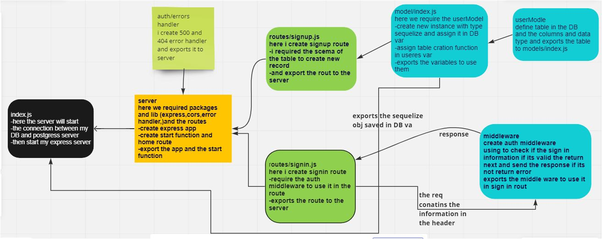

# basic-auth
UML diagrame

in this lab :
- create express server 
- create sign in route 
- create signup route 
- create userModel and use it to create table in DB and assign recordes in it 
- crate basic auth middleware : to check the sign in informaion 
- use bcrypt to hash the password 
- use bcrypt.compare to compare between the inserted password and the hashed password in the DB
- use base64 to decode the password 
- create test to check if my routes work prperly 
[herokuApp](https://basic-auth-task.herokuapp.com/) 
[PR link](https://github.com/idreesalmasri/basic-auth/pull/3) 
[actions linke](https://github.com/idreesalmasri/basic-auth/actions)
